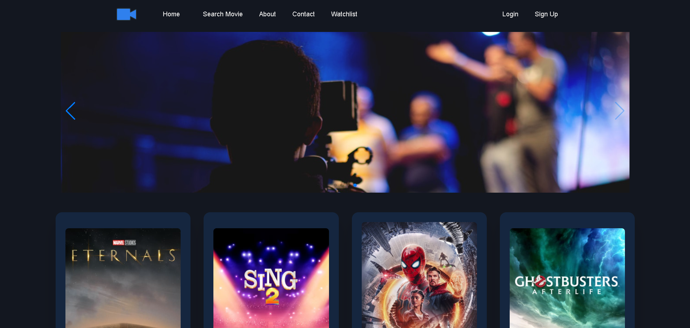
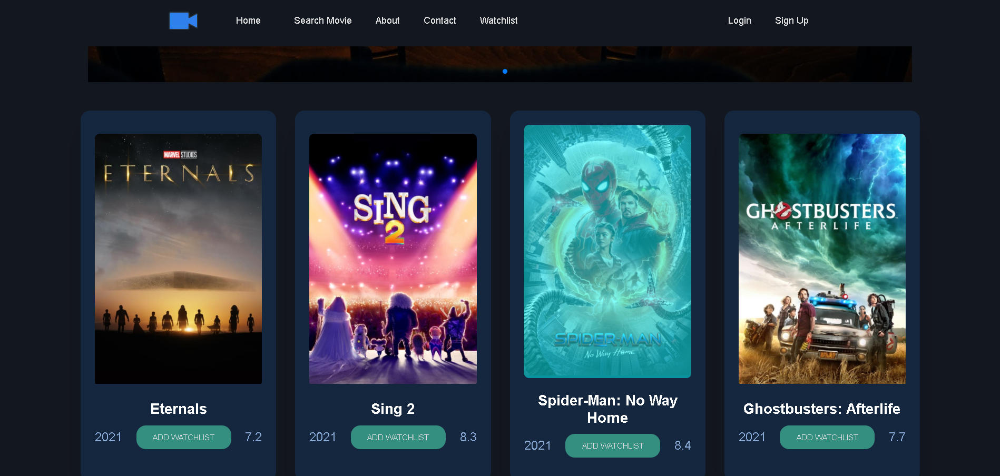
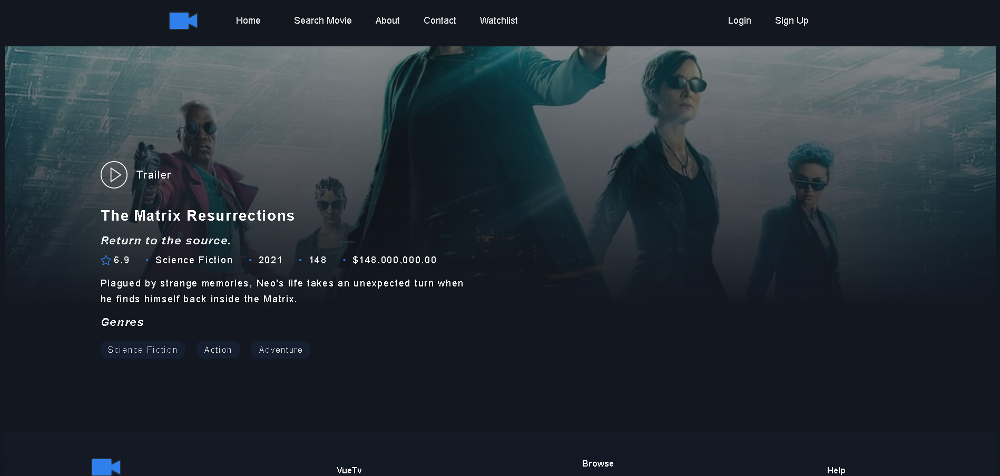
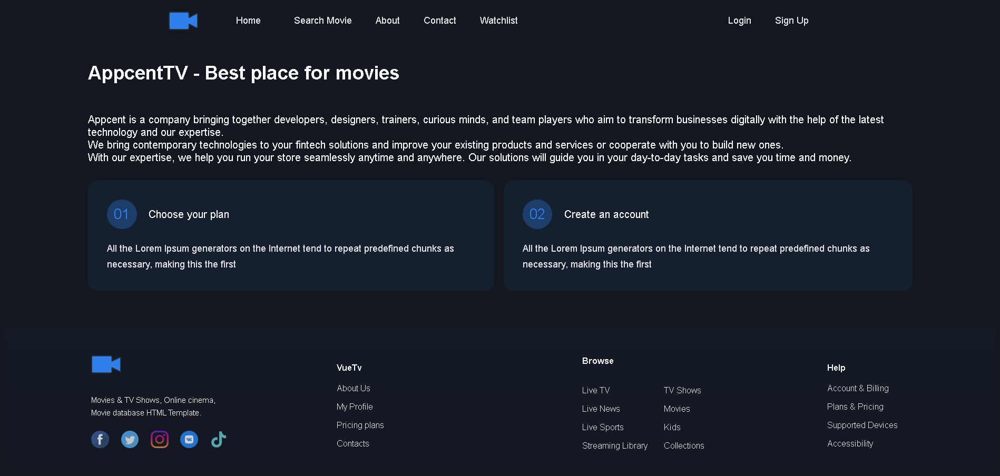
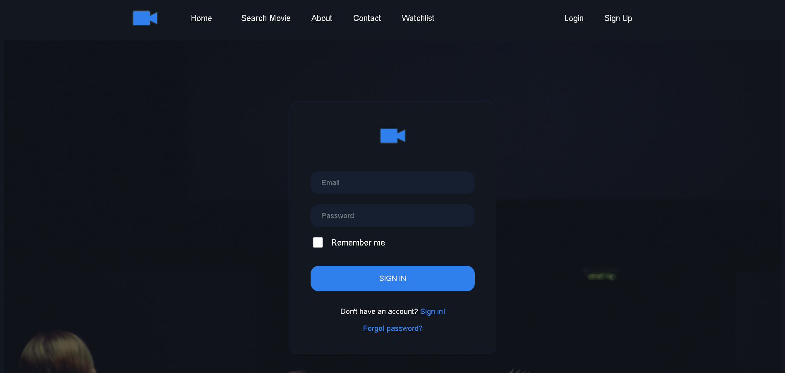

<div id="top"></div>

<!-- ABOUT THE PROJECT -->

## About The Project

This application is made with Vue.js. Within the application, you can see popular movies from the TMDB API, as well as search for a movie you want and add any movie to your watch list. In the application, there are a total of 6 pages, including Popular movies, movie details, log-in, registration, movie search, about us, and contact.  
The application works in sync with local storage.

<p align="right">(<a href="#top">back to top</a>)</p>

### Built With

- [Vue.js](https://vuejs.org/)
- [Prime Vue](https://primefaces.org/primevue/showcase/#/)

### Tools

- [Vuex](https://vuex.vuejs.org/)
- [Vue-Router](https://router.vuejs.org/)
- [Axios](https://github.com/axios/axios)
- [Sass](https://sass-lang.com/)
- [Vuelidate](https://vuelidate.js.org/)
- [PrimeFlex](https://www.primefaces.org/primeflex/)
- [Vue-Toast-Notification](https://www.npmjs.com/package/vue-toast-notification)
- [Debounce](https://www.npmjs.com/package/debounce)
- [Vuex-Persisted-State](https://www.npmjs.com/package/vuex-persistedstate)
- [Vue-Awesome-Swiper](https://github.surmon.me/vue-awesome-swiper/)
- [Vue-Svg-Loader](https://www.npmjs.com/package/vue-svg-loader)

<p align="right">(<a href="#top">back to top</a>)</p>

  <!-- Project Screenshots -->

## Screenshots

#### Home



#### Movie Card



#### Movie Detail



#### About



#### Contact


#### Login



<!-- GETTING STARTED -->

## Getting Started

This is an example of how you may give instructions on setting up your project locally.  
To get a local copy up and running follow these simple example steps.

### Prerequisites

This is an example of how to list things you need to use the software and how to install them.

- npm
  ```sh
  npm install npm@latest -g
  ```

````
### Installation

1. Get a free API Key at [TMDB](https://www.themoviedb.org/)
2. Clone the repo
  ```sh
  git clone https://github.com/sunaycansev/appcent-movie-app
```3. Install NPM packages
  ```sh
  npm install
```4. Enter your API in `.env`
 ```shell
  VUE_APP_API_KEY = 'ENTER YOUR API'
  VUE_APP_BASE_API_URL = https://api.themoviedb.org/3
````

<p align="right">(<a href="#top">back to top</a>)</p>

<!-- USAGE EXAMPLES -->

<!-- ROADMAP -->

## TODOS

- [ ] Vuelidate
- [ ] Firebase Auth
- [ ] Sass refactor
- [ ] User based watchlist

<p align="right">(<a href="#top">back to top</a>)</p>

<!-- LICENSE -->

## License

Distributed under the MIT License. See `LICENSE.txt` for more information.

<p align="right">(<a href="#top">back to top</a>)</p>

<!-- CONTACT -->

## Contact

Ferhat Sunay Cansev - fsunaycansev@gmail.com

Project Link: [https://github.com/sunaycansev/appcent-movie-app](https://github.com/sunaycansev/appcent-movie-app)

<p align="right">(<a href="#top">back to top</a>)</p>

<!-- https://www.markdownguide.org/basic-syntax/#reference-style-links -->
